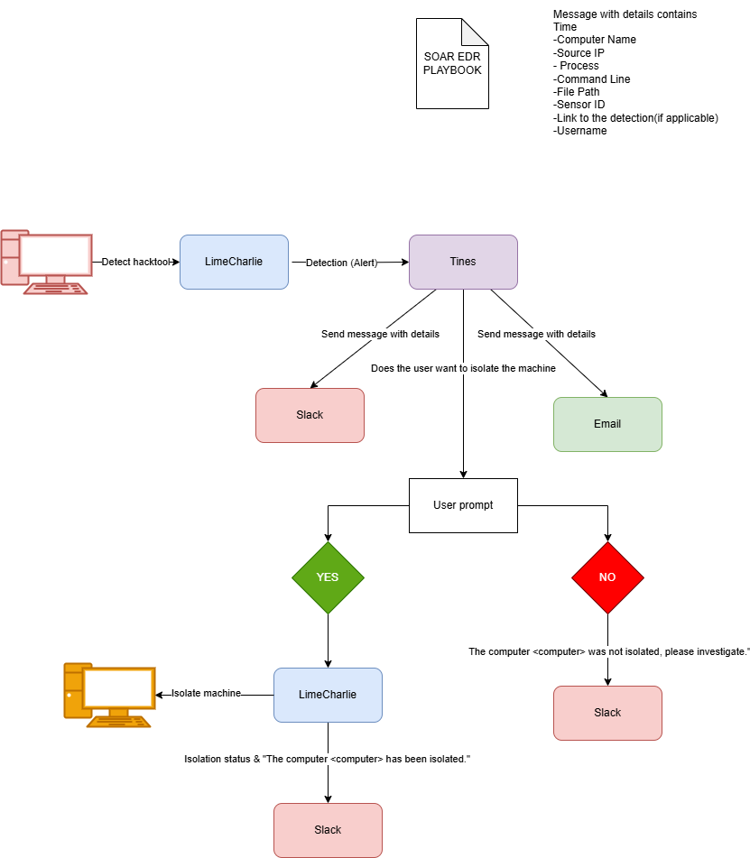
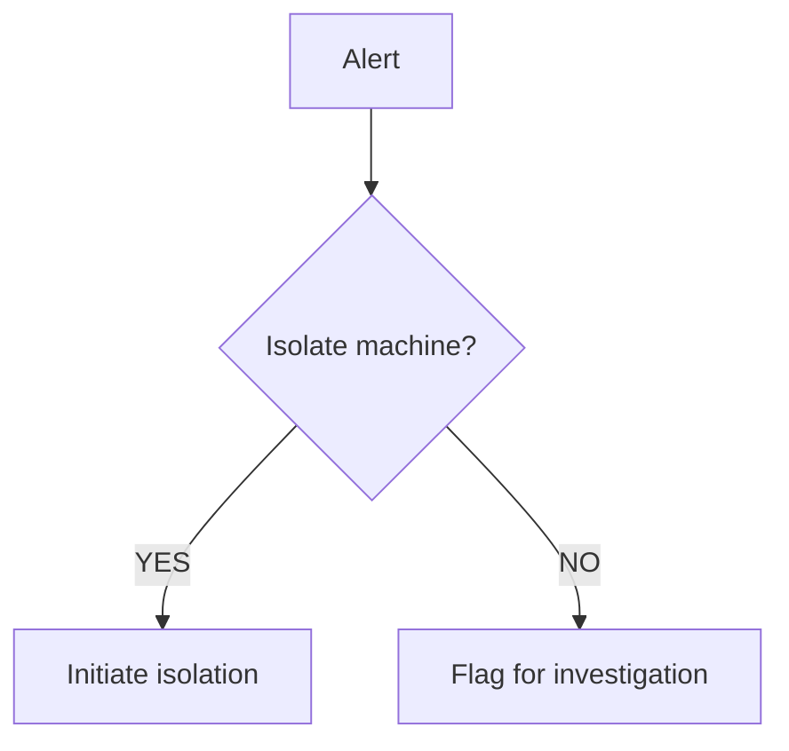

# SOAR-EDR
# Playbook

A Security Orchestration, Automation, and Response (SOAR) system integrated with Endpoint Detection and Response (EDR) capabilities.

## Workflow Overview

### 1. Alert Ingestion
- Receives alerts from LimaCharlie EDR
- Processes through Tines automation
- Captures alert details:
  - Timestamp
  - Computer name
  - Source IP
  - Process info
  - Command line
  - File path
  - Sensor ID
  - Detection link
  - Username

### 2. Notification
- **Slack**: Instant alerts
- **Email**: Audit trail

### 3. Isolation Decision

## Response Actions

| Decision | Actions |
|----------|---------|
| ✅ **YES** | • Isolate via LimaCharlie • Verify isolation status • Send confirmation notification |
| ❌ **NO**  | • Log decision in audit trail • Create investigation ticket • Notify security team |

## Integrated Components

| Component       | Purpose                                | Integration Type               |
|-----------------|----------------------------------------|--------------------------------|
| **LimaCharlie** | EDR core system for detection          | Primary detection source       |
| **Tines**       | Workflow automation and orchestration  | Playbook execution             |
| **Slack**       | Real-time alert notifications         | Communication channel          |
| **Email**       | Audit trail and documentation          | Secondary notification         |
